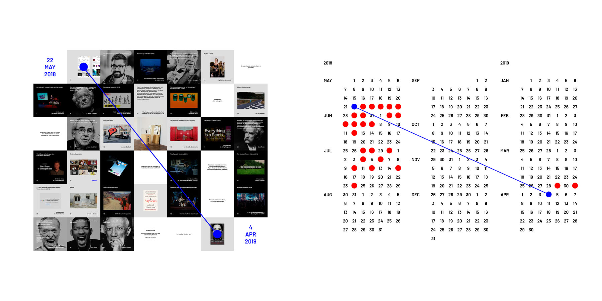

### I am here to share where I come from, where I am and where I am going.

Hi IG. Last time I was using you I was trying to establish a new relationship with you. I remember I was trying to use you to put some order inside my head, to trigger conversations and create new connections by exposing myself in a more organized way.⁣

This was after exploring and playing with the limits of the platform for a while.⁣

Now I am back. New stage, new projects, new objectives but similar intentions. First of all I will show you, one post at a time, what I've been doing for the past couple of years, what I am doing now and what my vision is for what is to come.⁣

So without further delay, I am going to start with this couple of principles in mind:⁣

— "Done is better than perfect", is here to help me to be more aware when my attention to the detail becomes too much, making me inefficient. I know that hidden behind my perfectionism there is a fear of making mistakes and other insecurities.⁣

— "Think big, but act small" as a reminder that I've been doing a lot of the first lately, but now it's time for action, and without breaking the big ideas into small chunks I easily get overwhelmed.⁣