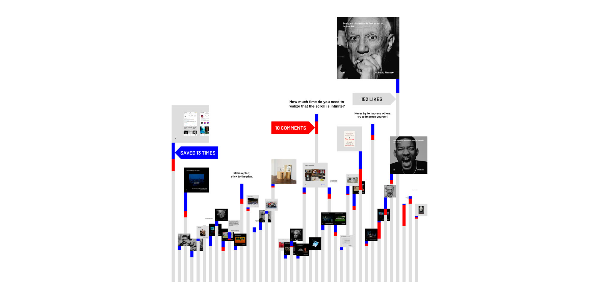

### Platforms designed to increase revenue.

Hi IG. This is how you see me, this is what I am for you. Metrics, statistics, graphs in reports. Another profile, another user.

I don't blame you because I perfectly understand your nature, why you observe me through these lenses, why you analyze me, why you surveil me.⁣⁣

What disappoints me is the imbalance in our relationship. You know a lot about me and I know very little about you.⁣⁣

I am willing to share, to give, and you systematically hide things from me and talk about me behind my back and yes, this disappoints me because it is rude, because you don't make me feel comfortable. You make it hard for me to believe all the beautiful things you tell me.⁣⁣

I am sorry but I don't trust you.⁣⁣

I wish our relationship could be different, more transparent, more honest, more empathic, more... balanced.⁣

📊

Horizontal axis: posts in chronological order.⁣

Vertical axis: number of interactions, divided by likes (gray), comments (red) and times the post has been saved (blue).