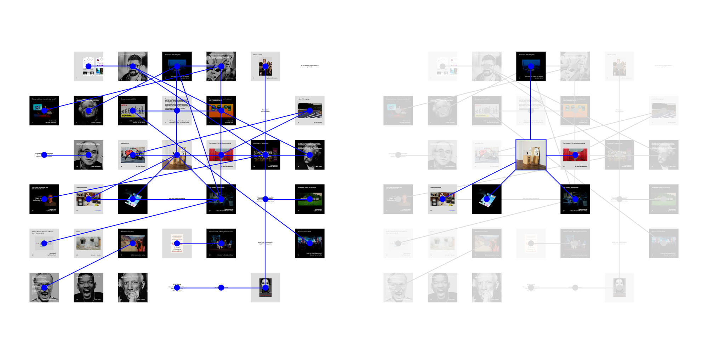

# Is it possible to change the paradigm that is constraining what it means to be digital?

Playing with you, in your playground, I've grown up.

I thought that by observing your behavior, challenging your limits, I would get to know you, but it was precisely in these areas where you begin and end that I had the opportunity to know more, not about you, but about myself. It's beyond the connections you impose on us where I'd like to be, really exposed to what it means to be digital.

That's why I left and the same reason I came back. 

I want to tell the story of what I've seen. 

Find others to play on unknown terrain, to question the inertia of the everyday, to learn together.

📉

In the image you can see me playing with hashtags, using them as identifiers, to create a graph of connections that would provide a different navigation within the platform.