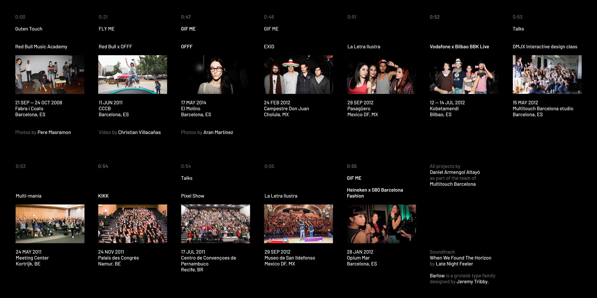

### My fascination with human behavior begins in 2008.

*Click [here](https://youtu.be/C4tRs7gHB1s) to watch the video for this post.*

I think it is important to start the story providing a bit of context.

💁🏻‍♂️

2008. I set up an interaction design studio with some friends, and we started to create interactive installations in physical spaces.⁣
⁣
We were amazed by how people interacted with our installations, and we realized that our interest was on designing for what was happening in front of the screen, not inside of it.⁣
⁣
We were designing experiences. Spaces that invited people to explore by playing.⁣
⁣
Our work was based on the idea that everybody is creative by nature and the results of our creativity, when shared, automatically become a source of inspiration for others.⁣
⁣
That period awakened and consolidated in me a profound fascination for human behavior.