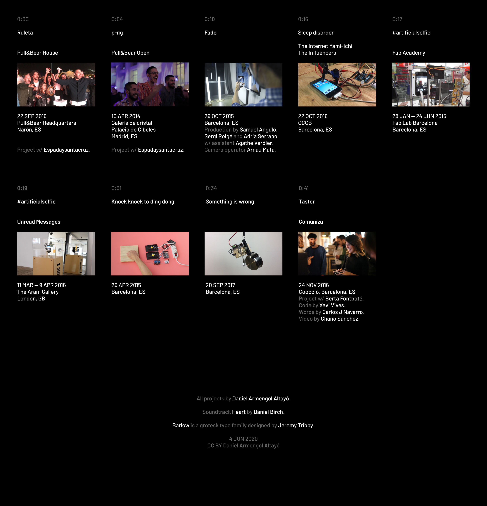

| Video `M:SS` | Project name | Client or context | Date/s `DD/MM/YY` | Place | Other |
|---|:---|:---|:---|:---|:---|
| `0:00` | Ruleta | Pull&Bear House | `22/09/16` | Pull&Bear Headquarters, Narón, ES | Project w/ Espadaysantacruz |
| `0:04` | p-ng | Pull&Bear Open | `10/04/14` | Galería de Cristal, Palacio de Cibeles, Madrid, ES | Project w/ Espadaysantacruz |
| `0:10` | Fade |  | `29/10/15` | Barcelona, ES | Production by Samuel Angulo, Sergi Roigé and Adrià Serrano w/ assistant Agathe Verdier. Camera operator Arnau Mata. |
| `0:16` | Sleep disorder | The Internet Yami-Ichi, The Influencers | `22/10/16` | CCCB, Barcelona, ES |  |
| `0:17` | #artificialselfie | Fab Academy | `28/01/15` `24/06/15` | Fab Lab Barcelona, Barcelona, ES |  |
| `0:19` | #artificialselfie | Unread Messages | `11/03/16` `09/04/16` | The Aram Gallery, London, GB |  |

<table style="border: none;">
    <tr>
        <td>
            
        </td>
        <td>
            world
        </td>
    </tr>
    <tr>
        <td>
            
        </td>
        <td>
            world
        </td>
    </tr>
</table>