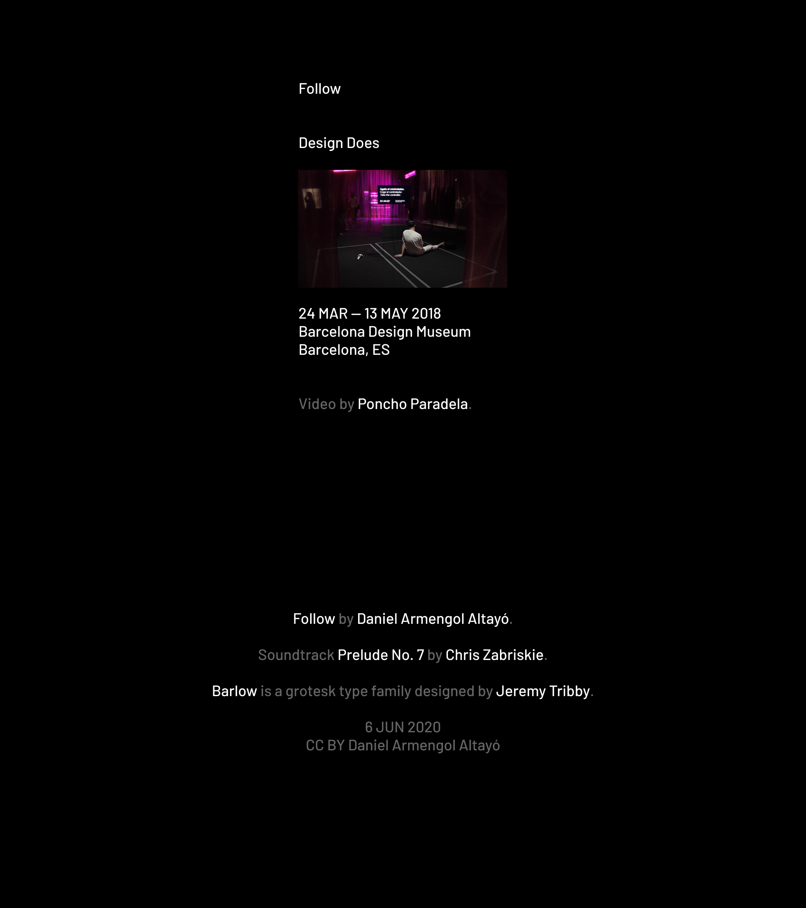

*Watch the video for this post in [English](https://youtu.be/iI8NY6_zNRU) or [Spanish](https://youtu.be/yFYPEr4fGtQ).*

# Technological devices and digital tools influence our behavior.

### 2018

This is me, wearing a virtual reality headset, being part of an exhibition that reflected on the role of design in our lives.

There was a controller on the floor, with a message inviting people to take it. 

When they did it, they didn't move only their controller, they moved also the controller I was holding in my hand.

This connection between the two devices gave the visitor the feeling of being able to control my movements, as if I were a human puppet.

My proposal was about the design of technological devices and digital tools, and their capability to influence our behavior, create new gestures or modify how we relate with our environment.

This project catalyzes a significant change in my way of seeing and understanding the world.

   

###### Spanish transcript:

### 2018

Este soy yo, conectado a unas gafas de realidad virtual, formando parte de una exposición que reflexionaba sobre el papel del diseño en nuestras vidas.

Había un mando en el suelo, al que se invitaba a la gente a coger.

Cuando lo hacían, no solo movían su mando, movían también el que yo tenía en mi mano.

Esa conexión entre ambos dispositivos ofrecía al visitante la sensación de poder controlar mis movimientos, como si fuera una marioneta humana.

Mi propuesta trataba sobre el diseño de los dispositivos tecnológicos y las herramientas digitales, y su capacidad para influir en nuestro comportamiento, crear nuevos gestos o modificar nuestra manera de relacionarnos con aquello que nos rodea.

Este proyecto cataliza un cambio significativo en mi forma de ver y entender el mundo.