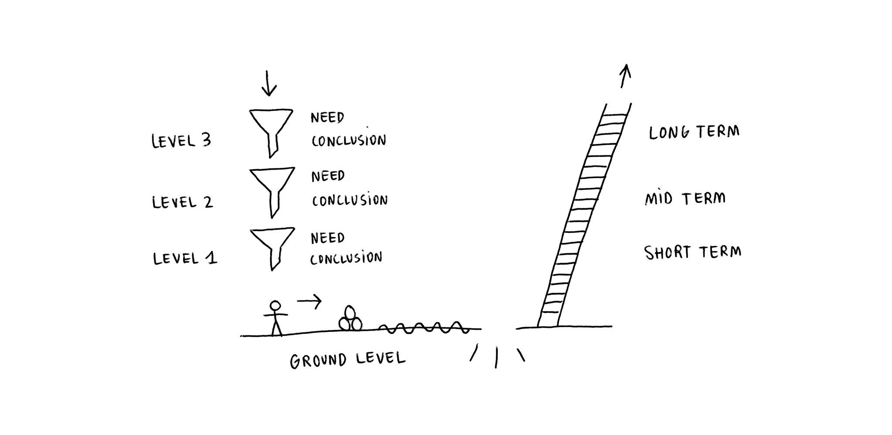

← [Needs and vision](needs-and-vision.md)

## Ground

Here is where I am now. The goal, my mission, is to keep moving forward to unexplored terrain. On the way I will encounter obstacles, quicksand that will slow me down and chasms that I will find a way to cross.

These are my current needs, ordered by priority, structured by why they are important, how I am approaching them and what can you do to help me or participate in the process. 

### Need to express myself

I need to put my ideas into words, transform them into something that can be shared and discussed with others.

###### Why it is important

- Without enough information is not possible to imagine what will come out of all of this and to understand the intentions behind the project.

###### How I am approaching it

- The next step is to focus on explaining how the tool will be and from there, the next steps will tackle design and development.
- I believe on sharing the values by being an example of them, not by just using words. Openness and transparency are key here. Empty words are useless for everybody, I am trying to make sense in every bit.

###### What can you do to help me or participate in the process

- Please, do not hesitate to question what you don't understand.
- Point out to what you think is wrong or where you disagree. Be constructive, share your point of view. 
- Be patient. Right now there is only one human working on it. Progress will be slow but steady.

### Need to expose Vewpoint

###### Why it is important

- I want to find people interested in my proposal, attracted to similar topics, disposed to collaborate or to contribute with their point of view.

###### How I am approaching it

- Sharing the process of creation, being as open and public as possible.

###### What can you do to help me or participate in the process

- I am looking for this profiles:
    - **developers** capable to accelerate the process of creating the tool, complimenting my skills. For the moment there is nothing important stopping me to continue the technical development, but the process will be slower.
    - **advisors**, people willing to guide me, open to contribute with their experience and expertise.
    - **curious people** interested in the project, predisposed to provide feedback and support.
- It's very easy to overload others with information when you're excited about something. Keep this in mind when sharing and remember, there is only one human working on it, trying to be efficient.

### Need to be efficient

I am committed to the project, I have a clear vision of where I am going and I am being constant in my actions. Now I need to keep the ball rolling. I want to be efficient, I need to find a good balance about where I invest my time and energy.

###### Why it is important 

- I've been always a perfectionist but I am aware of the disadvantages of it. I don't want to lose time on unnecessary details.
- I really enjoy a lot the pleasures of a good conversation and I know that interaction with others is key to enrich my own perspective, but I don't want to lose track of time because of that.
- Learning and researching is also part of the journey, but it's easy to accommodate between books and links. I've spent a lot of time doing it, now it's time to prioritize directed action, research will take place during the process and I'll learn by doing.

###### How I am approaching it

- I will try different systems to keep track of progress so that I can be more systematic in reviewing and planning.

###### What can you do to help me or participate in the process

- If you see me losing my balance, please, let me know.

### Need to make Vewpoint economically sustainable

To keep a project alive, the people working on the project need to sustain themselves financially, via other sources or through the project itself. My approach is the latter.

This is not a priority at this time because I was able to optimize my lifestyle by reducing my financial dependencies, and thus continue to work full time with only savings, for a few more months.

This need will become more urgent as time goes by, and I have already begun to evaluate some strategies, but I will not develop them further now.