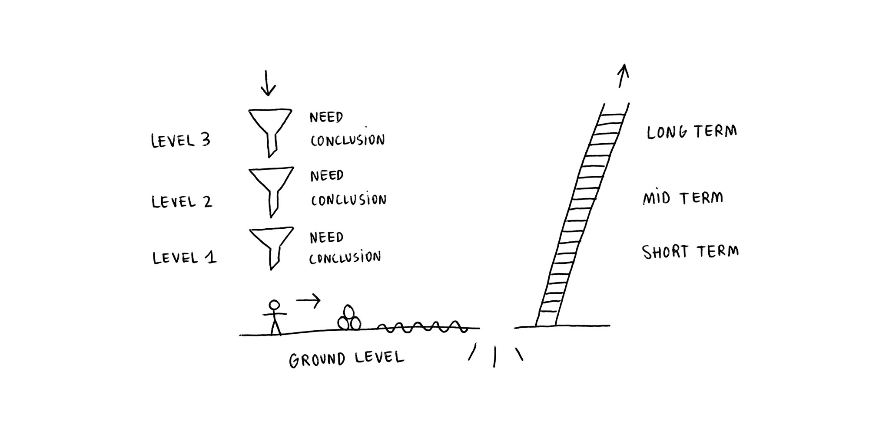

# Needs and vision

The goal for this text is to provide context for a better understanding of current needs, in an effort to share with others what kind of collaboration can be most useful at this stage.

With this text I am going to explain briefly the process of discovery I went through that brings me here, through the lens of the needs I had (and still have), the conclusions I reached, the current needs of the project and those I will have in a near future, and finally, the vision I established as a guide to follow with Vewpoint.

This is an overview, dependant on the present moment, meaning that it will be evolving with the new needs for the project. Future complementary texts will tackle some of the topics mentioned here more in-depth.

I drew a map as a visual reference for the story I'm about to tell. Use the outline below to navigate between sections.

- [The funnels](funnels.md)
    - Level 3
        - Need: Cognitive needs + human behavior + digital information.
        - Conclusion: The capacity to process information is power.
    - Level 2
        - Need: Process information differently.
        - Conclusion: Create your own tools.
    - Level 1
        - Need: Transform ideas into a usable tool.
        - Conclusion: I can not do it alone. I am not alone.
- [Ground](ground.md)
    - Need to express myself
    - Need to expose Vewpoint
    - Need to be efficient
    - Need to make Vewpoint economically sustainable
- [The ladder](ladder.md)
    - Short term: Connect the web differently
    - Mid term: Empower people
    - Long term: Expand human cognition